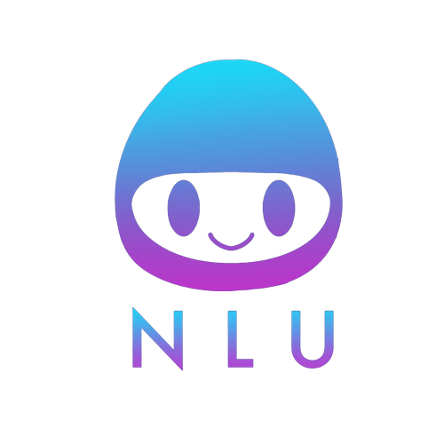

<a name="readme-top"></a>

[![Contributors][contributors-shield]][contributors-url]
[![Stargazers][stars-shield]][stars-url]
[![Issues][issues-shield]][issues-url]
[![Apache License][license-shield]][license-url]


<!-- PROJECT LOGO -->
<br />
<div align="center">
  <a href="https://github.com/KareemSalem7/voice-flow">
    
  </a>

<h3 align="center">Voiceflow Chatbot Transcript Analyzer</h3>

<h4 align="center">By Team N.L.U. - <b>N</b>atural <b>L</b>eaders <b>U</b>nited</h4>

  <p align="center">
    The aim of our project is to access the transcript data of pre-existing chatbots from within Voiceflow using the API, and to parse and analyze this data to return strong starter-node suggestions for customer chatbots!
    <br />
    <a href="https://github.com/KareemSalem7/voice-flow"><strong>Explore the docs »</strong></a>
    <br />
    <br />
    <a href="https://www.voiceflow.com/">Check Out Voiceflow</a>
    ·
    <a href="https://github.com/users/rumncoke-ai/projects/1">View Kanban Board</a>
    ·
    <a href="https://github.com/rumncoke-ai/Team-NLU-Voiceflow-Extension"> See the Backend</a>
  </p>
</div>


<!-- TABLE OF CONTENTS -->
<details>
  <summary>Table of Contents</summary>
  <ol>
    <li>
      <a href="#about-the-project">About The Project</a>
      <ul>
        <li><a href="#built-with">Built With</a></li>
      </ul>
    </li>
    <li>
      <a href="#getting-started">Getting Started</a>
      <ul>
        <li><a href="#prerequisites">Prerequisites</a></li>
        <li><a href="#installation">Installation</a></li>
      </ul>
    </li>
    <li><a href="#usage">Usage</a></li>
    <li><a href="#license">License</a></li>

  </ol>
</details>

<!--     <li><a href="#acknowledgments">Acknowledgments</a></li> -->


<!-- ABOUT THE PROJECT-->
## About The Project

The aim of this project is to take users' pre-built chatbots on the Voiceflow platform and to parse and analyze their transcripts in order to offer suggestions for starting nodes (i.e., the initial message). We generate these suggestions based on a variety of metrics, from the overall frequency of intents to the rate at which they appear at leaf nodes (i.e., the end of an interaction). Users will then have the option to sort through these suggestions and, should they resonate with any, choose to have it automatically inserted into their Voiceflow canvas.

<!-- [![Product Name Screen Shot][product-screenshot]](https://example.com) -->

<p align="right">(<a href="#readme-top">back to top</a>)</p>


### Built With

* [![React][React.js]][React-url]
* [![Bootstrap][Bootstrap.com]][Bootstrap-url]
* [![Sass][Sass.com]][Sass-url]
* [![Npm][Npm.com]][Npm-url]
* [![styledcomponents][styled-components.com]][styled-components-url]
* [![Jest][Jest.com]][Jest-url]
* [![Netlify][Netlify.com]][Netlify-url]
* [![Babel][Babel.com]][Babel-url]

<p align="right">(<a href="#readme-top">back to top</a>)</p>


<!-- GETTING STARTED -->
## Getting Started

This is an example of how you may give instructions on setting up your project locally.
To get a local copy up and running follow these simple example steps.

### Prerequisites

Here are the prerequisites required to run this project:
* npm
  ```sh
  npm install
  npm install --save styled-components
  npm install react-router-dom@6
  npm install framer-motion
  npm install sass
  npm install bootstrap

  ```

### Installation

1. Clone the repo
   ```sh
   git clone https://github.com/KareemSalem7/voice-flow.git
   ```
2. Install NPM packages
   ```sh
   npm install
   ```
3. Run the project by entering the following into your terminal:
   ```sh
   npm run start
   ```
4. Access the project by going to http://localhost:3000

<p align="right">(<a href="#readme-top">back to top</a>)</p>


<!-- USAGE EXAMPLES--> 
## Usage

How to Use:

NOTE: You will also need to have the backend repository running locally on your machine in order to see the full-functionality of the application.

1.) On the landing page, click “Analyze My Chatbot!”

2.) Enter the requested information into the subsequent form. Click on “Submit” when done.

3.) From the main page, you will be able to see the suggested prompts generated from the information you submitted. You can click on “Re-upload Information” to return to the previous page, “Help” for further information, or on “Generate My Prompt” to have a block generated on your Voiceflow canvas (IPR) and be taken to the end page.

<!--_For more examples, please refer to the [Documentation](https://example.com)_-->

<p align="right">(<a href="#readme-top">back to top</a>)</p>

<!-- LICENSE -->
## License

Distributed under the Apache License. See `LICENSE` for more information.

<p align="right">(<a href="#readme-top">back to top</a>)</p>


<!-- ACKNOWLEDGMENTS 
## Acknowledgments

* []()
* []()
* []()

<p align="right">(<a href="#readme-top">back to top</a>)</p> -->


<!-- MARKDOWN LINKS & IMAGES -->
<!-- https://www.markdownguide.org/basic-syntax/#reference-style-links -->
[contributors-shield]: https://img.shields.io/github/contributors/KareemSalem7/voice-flow.svg?style=for-the-badge
[contributors-url]: https://github.com/KareemSalem7/voice-flow/graphs/contributors
[stars-shield]: https://img.shields.io/github/stars/KareemSalem7/voice-flow.svg?style=for-the-badge
[stars-url]: https://github.com/KareemSalem7/voice-flow/stargazers
[issues-shield]: https://img.shields.io/github/issues/KareemSalem7/voice-flow.svg?style=for-the-badge
[issues-url]: https://github.com/rumncoke-ai/Team-NLU-Voiceflow-Extension/graphs/issues
[license-shield]: https://img.shields.io/badge/License-Apache_2.0-blue.svg?style=for-the-badge&logo
[license-url]: https://github.com/KareemSalem7/voice-flow/blob/master/LICENSE
[product-screenshot]: images/screenshot.png
[React.js]: https://img.shields.io/badge/React-20232A?style=for-the-badge&logo=react&logoColor=61DAFB
[React-url]: https://reactjs.org/
[Bootstrap.com]: https://img.shields.io/badge/Bootstrap-563D7C?style=for-the-badge&logo=bootstrap&logoColor=white
[Bootstrap-url]: https://getbootstrap.com
[Sass.com]: https://img.shields.io/badge/Sass-CC6699?style=for-the-badge&logo=sass&logoColor=white
[Sass-url]: https://sass-lang.com/
[Npm.com]: https://img.shields.io/badge/npm-CB3837?style=for-the-badge&logo=npm&logoColor=white
[Npm-url]: https://www.npmjs.com/
[Jest.com]: https://img.shields.io/badge/Jest-C21325?style=for-the-badge&logo=jest&logoColor=white
[Jest-url]: https://jestjs.io/
[Netlify.com]: https://img.shields.io/badge/Netlify-00C7B7?style=for-the-badge&logo=netlify&logoColor=white
[Netlify-url]: https://www.netlify.com/
[Babel.com]: https://img.shields.io/badge/Babel-F9DC3E?style=for-the-badge&logo=babel&logoColor=white
[Babel-url]: https://babeljs.io/
[styled-components.com]: https://img.shields.io/badge/styledcomponents-DB7093?style=for-the-badge&logo=styled-components&logoColor=white
[styled-components-url]: https://styled-components.com/

